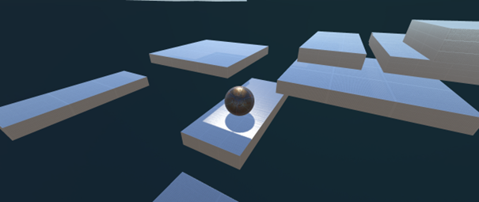
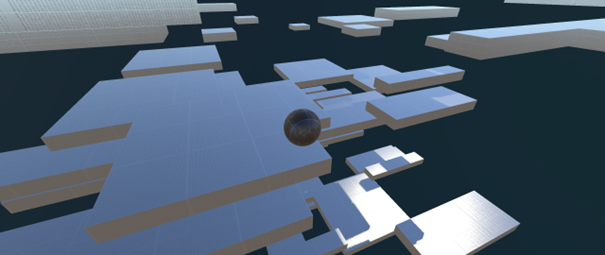
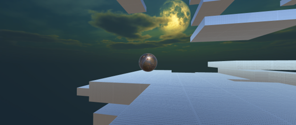
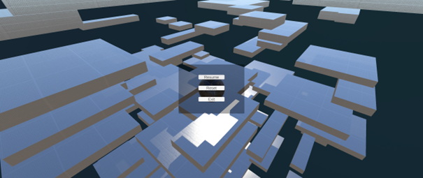
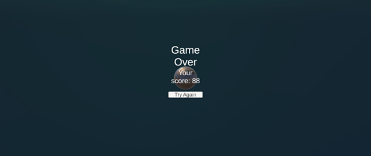

# GraZrecznosciowaKulka
Trójwymiarowa gra zręcznościowa stworzona w silniku Unity. Steruj kulką, skacz po platformach i zdobywaj jak najwyższy wynik!
## Opis gry
Wcielasz się w kulkę, której zadaniem jest wspinanie się jak najwyżej po pojawiających się platformach. W grze występują zarówno platformy statyczne, jak i ruchome, co zwiększa poziom trudności. Uważaj, aby nie spaść – gra kończy się, gdy kulka spadnie poniżej określonego poziomu.
## Sterowanie
- Ruch: W, A, S, D lub strzałki
- Skok: Spacja
- Obrót kamery: Mysz
- Pauza: Escape
## Zrzuty ekranu
Poniżej znajdziesz kilka zrzutów ekranu przedstawiających rozgrywkę oraz interfejs użytkownika gry: 
Rozgrywka: 

UI podczas gry: 

Ekran przegranej: 

## Jak uruchomić projekt
1. Otwórz projekt w Unity (zalecana wersja: 2021.3 LTS lub nowsza).
2. Otwórz scenę SampleScene z folderu Assets/Scenes.
3. Wciśnij Play i baw się dobrze!
## Pobierz gotową wersję gry
Aby pobrać gotową, działającą wersję gry, skorzystaj z poniższego linku do Google Drive: 
[Pobierz grę z Google Drive](https://drive.google.com/drive/folders/1AhI8i2iYmFg_rvfx5X-3g05eXTUUcU_U?usp=sharing) 
Po pobraniu rozpakuj archiwum i uruchom plik GraZrecznosciowaKulka.exe, aby zagrać bezpośrednio, bez potrzeby instalowania Unity.
## Wykorzystane zasoby
- Tekstury i materiały: Fantasy Skybox FREE, PBS Materials Variety Pack, WorldMaterialsFree
- UI: TextMesh Pro
- System wejścia: Unity Input System
## Autor
Łukasz Szkatuła
